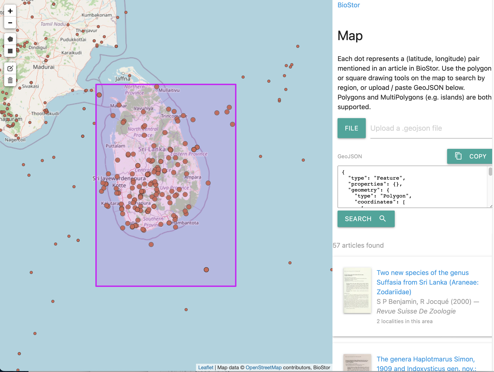

# BHL Workshop

# https://github.com/rdmpage/bhl-workshop

# 7724 9102

## Overview

This is a workshop on the [Biodiversity Heritage Library](https://www.biodiversitylibrary.org) (BHL), a large, open access collection  of literature on biodiversity.

The goal is to explore some approaches to discovering content in the more than 64 million pages BHL provides. Most of these approaches are exploratory, "proof of concept" tools, and I make no claim that these tools are fit for purpose, or are the only ways we could explore BHL. Indeed, if you have ideas for ways to get more out of BHL please feel free to share them.

While the workshop is an in-person event, the activities are all online, so if you are not able to attended you should still be able to get something from this event.

The workshop starts with an opportunity to quickly introduce yourself, followed by a similarly short introduction to BHL. Then we will explore a range of topics.

## Introduction

To help get a sense of your interests, and your experience (if any) with BHL, we have a short Menti quiz where you can tell us a little about yourself (the quiz is anonymous). You can join the quiz using the link https://www.menti.com/0bc0bf or go to https://www.menti.com and enter the code 7724 9102.

## BHL overview

The website [BHL on a Hilbert curve](https://bhl-workshop.iphylo.org/bhl-all-the-pages/) is an attempt to show a small fraction of BHL on a single web page, just to give a sense of the diversity of content in BHL, and one of the primary challenges, which is finding stuff.

If you are taking part in this workshop it is likely that you have some experience with BHL, never the less it is probably worth listing some of the ways to access BHL.

### Ways to access BHL

- BHL displays scanned content using a scrollable viewer, e.g. [Amphibian & reptile conservation v.9:no.1=no.16(2015)](https://www.biodiversitylibrary.org/item/199416)
- you can search BHL by taxonomic name, such as [*Aerodramus*](https://www.biodiversitylibrary.org/name/Aerodramus) or by text, such as [holotype specimen](https://www.biodiversitylibrary.org/search?stype=F&searchTerm=holotype+specimen#/titles)
- there are [data downloads and a well documented API](https://about.biodiversitylibrary.org/tools-and-services/developer-and-data-tools/)
- you can access images and OCR text directly via [Amazon Web Services](https://registry.opendata.aws/bhl-open-data/)
- many of the colour plates (the "pretty") from BHL are also on [Flickr](https://www.flickr.com/photos/biodivlibrary/with/53903344408)
- there is a [discussion forum](https://forum.biodiversitylibrary.org)

### BHL helpers

There are projects that assist BHL in adding value to its content, such as [Global Names](https://globalnames.org) (taxonomic name indexing) and [BioStor](https://biostor.org) (article finding).

[BioStor](https://biostor.org) has a simple search interface, as well as ways to view articles arranged by journal, and also on a map. We will explore the map feature in more detail below.

## Exercise: Viewing content

The first topic is probably the most obvious: how to display articles on BHL? The current site uses a "book viewer" based on code from the Internet Archive. Let's look at some of the alternatives.

The same article in five different viewers:

- [Current BHL viewer](https://www.biodiversitylibrary.org/item/244617)
- [EJT PDF viewer](https://europeanjournaloftaxonomy.eu/index.php/ejt/article/view/76/25)
- [BHL Light viewer](https://bhl-workshop.iphylo.org/bhl-light/item/244617)
- [IIIF viewer with Plazi annotations](https://ejt.biodiversity.hasdai.org/records/fyh4q-xg421)
- [Experimental responsive viewer](https://rdmpage.github.io/responsive-viewer/) (code on [GitHub](https://github.com/rdmpage/responsive-viewer))

The final viewer displays both the BHL page images, but also OCR text from [Datalab](https://www.datalab.to), and an IIIF viewer. The later is a standard widely used in the museum and archive world to display images. We will meet [IIIF](https://iiif.io) again below.

- :warning: We have a short menti quiz

## BHL search

BHL has full text search, which in principle means you can search for any text you like. However it has some limitations, which you can see if you search for the following strings:

- [Afrophyla gen nov](https://www.biodiversitylibrary.org/search?stype=F&searchTerm=Afrophyla+gen+nov#/titles)

If you click on the “⊞ Details” link below a search result you will see the text that BHL matched on. The item with the best match is not top of the list of search results.

- [Notes synonymiques sur divers Dasytides](https://www.biodiversitylibrary.org/search?stype=F&searchTerm=Notes+synonymiques+sur+divers+Dasytides#/titles)

The top two hits do have this string, but [page 64720438](http://www.biodiversitylibrary.org/page/64720438) which also has this string does not appear on the first page of search results.

Can you figure out what is going on?

## BHL name search

Arguably BHL’s “killer feature” is taxonomic name indexing, provided by [Global Names](https://globalnames.org). Each page in BHL has been searched for strings that look like taxonomic names, and these have been indexed so that you can search by taxonomic name. Sometimes it finds strings that aren’t taxonomic names (or, might be taxonomic names, but in most cases aren’t). For example [Scutellum](https://www.biodiversitylibrary.org/name/Scutellum) or [Argentina](https://www.biodiversitylibrary.org/name/Argentina).

### Exercise: Taxonomic timelines

Viewing changes in word usage overtime was popularised by the [Google Books Ngram Viewer](https://books.google.com/ngrams/) tool. Ryan Schenk's synynyms tool (now offline, see [Taxonomic name timelines for BHL](https://iphylo.blogspot.com/2016/12/taxonomic-name-timelines-for-bhl.html), Ryan’s code is in [GitHub](https://github.com/rschenk/synynyms)) was an early example of a similar approach to taxonomic names. 

In this workshop we will use a simple tool that traces the occurrences of a taxonomic name in BHL over time. In contrast to BHL itself, the [BHL Name Timeline](https://bhl-workshop.iphylo.org/bhl-name-timeline/) attempts to aggregate occurrences of names by BHL item or part (in other words, if a name occurs in several pages that are part of the same article, BHL Name Timeline lists those occurrences just once).

You can ask the tool to fetch synonymns for a taxonomic name from the [Catalogue of Life](https://www.catalogueoflife.org), or you can list two or more names separated by comma. For example, you can compare usages of two alternative names for the [sperm whale](https://en.wikipedia.org/wiki/Sperm_whale), _Physeter catodon_ and _Physeter macrocephalus_ (for fun see the Wikipedia talk page on these two names [catodon](https://en.wikipedia.org/w/index.php?title=Talk:Sperm_whale/Archive_1&commentname=h-UtherSRG-2008-10-03T04%3A59%3A00.000Z&section=catodon#:~:text=We%20should%20follow%20MSW3%2C%20as%20it%20is%20what%20is%20used%20in%20nearly%20all%20other%20mammal%20articles%20on%20Wikipedia.)).

- :warning: We have a short menti quiz

## BHL image search

BHL has 64 million images of pages. So far we have concentrated on exploring BHL using text, but what about images? In this section we will look at two tools for image classification and search.

### Demo: Image classification

Mike Trizna created a [Hugging Face space](https://huggingface.co/spaces/MikeTrizna/bhl_clip_classifier) that uses OpenAI's [CLIP](https://huggingface.co/openai/clip-vit-base-patch32) model to classify BHL pages. You supply an image (there are examples you can chose from) and a list of possible categories, for example:
- A page of printed text; 
- A page of handwritten text;
- A blank page with no text;
- A cover of a book;
- A page of a book that contains a large illustration;
- A page that features a table with multiple columns and rows

and the tool will return the probability that the image belongs in each of those categories.

Tools like this image classifier could help BHL automate the tags it assigns to pages, perhaps enabling users to search for categories of pages (e.g., "show me pages that display maps").

#### Exercise: IIIF Illustration Detector 

The [IIIF Illustration Detector](https://huggingface.co/spaces/small-models-for-glam/iiif-illustration-detector) is a cool demonstration of using a [small LLM that runs in your browser](https://huggingface.co/small-models-for-glam/historical-illustration-detector) to decided whether a page has an illustration or not. It needs a IIIF manifest for the item whose pages you want to classify, you can get manifests from BHL-Light, e.g. https://bhl-workshop.iphylo.org/bhl-light/item/244617/manifest.json

Paste in a manifest, click “Load Manifest” then “Classify” and it works through each page as you watch.

### Exercise: Image search

The image classifier Mike Trizna put together inspired the next tool we will look at, [BHL image search](https://bhl-workshop.iphylo.org/bhl-image-search/), code on [GitHub](https://github.com/rdmpage/bhl-all-the-images). This tool takes a small subset of BHL page images and uses the CLIP model to convert each model to an [embedding](https://en.wikipedia.org/wiki/Embedding_(machine_learning)), that is a vector or list of numbers that represent that image. Images that are similar in some sense will typically have similar vectors, which makes images searchable. 

#### Find similar images

For example, consider this image from Wikipedia [_Acraea violae_](https://en.wikipedia.org/wiki/Acraea_%28butterfly%29#/media/File:Tawny_Coster(হরিনছড়া)DSC_0165.JPG).

DSC_0165.JPG)

We can upload this to https://bhl-workshop.iphylo.org/bhl-image-search/ and click **Find similar pages** and the site returns images from BHL that resemble that butterfly. You can try this with any image.

#### Find images of...

The CLIP model enables you to search for images based on text, foe example, here are the results for search for [red flowers](https://bhl-workshop.iphylo.org/bhl-image-search/?q=red+flowers&k=12):

Try this for yourself. For instance, search for "maps"

#### Beyond page images

An obvious limitation of this approach is that we are comparing page images rather than individual images. A more sophisticated approach would be to separate images from text and search on just the images. There are increasingly sophisticated tool for doing this, such as those provided by Datalab (see their [playground](https://www.datalab.to/app/playground/documents/new)). Imagine being able to extract all the figures in BHL and make them searchable (see the next topic for further discussion of how feasible this is).

- :warning: We have a short menti quiz

## BHL knowledge discovery layer (NHM)

Qianqian Hiris Gu from the Natural History Museum in London will introduce a new project to build a search and discovery interface for BHL.

The one-year project launched in June 2026 and will use AI tools to improve the text extracted from scanned pages using optical character recognition (OCR), identify individual articles within volumes, and extract illustrations and tables.

Improving the OCR could make information discoverable that was previously missed or misread, such as scientific names, collector names and specimen identifiers. Identifying individual articles will also help users find and cite the relevant work within a larger volume.

Alongside this, we will identify several types of information—or “entities”—mentioned in the literature:

- **Taxa:** scientific names, including historical names and variations in how they are written.
- **People:** collectors, authors and other people mentioned in the text.
- **Places:** localities, including historical place names.
- **Institutions:** museums, herbaria and other organisations, including their names and collection codes.
- **Specimen identifiers:** catalogue and accession numbers that can help connect literature to specimens held in collections.

We will also explore extracting references to habitats and geological units or time periods. Wherever possible, the entities will be linked to records in resources such as GBIF, Catalogue of Life and Wikidata.

These links can help bring together different names or abbreviations for the same taxon, person or institution. We will retain the original wording and links to the source pages so users can check the information and assess uncertain matches.

### What will the interface offer?

We are building a web-based search and discovery interface alongside the existing BHL website. Users will be able to search the full text or search for any of the entities listed above, then filter results by content type (for example, book, article, image or table), publication date and author.

For example, you could search for illustrations associated with a particular species in publications from 1950 to 1960. Each result will link back to the original BHL page so you can view it in context.

### Help shape the discovery layer

We will give an overview of these plans and invite suggestions from participants:

- What information would you most like to find more easily in BHL?
- Which features would be most useful for finding and exploring information in BHL?
- What would most help you judge whether information extracted automatically from BHL is reliable?
## Exercise: BHL knowledge discovery layer (NHM)

Your suggestions will help us refine the interface and prioritise the information it makes available.
- :warning: We have a short menti quiz

## BHL and geography

In this part of the workshop we explore geographic interfaces to literature data. There are various interfaces to biodiversity literature, such as [JournalMap](https://www.journalmap.org) and [BioStor](https://biostor.org/map). While many will be familiar with point-based geographic data, other approaches are available such as grids (e.g., [H3](https://h3geo.org), see also [Uber H3 viewer](https://clupasq.github.io/h3-viewer/). The defunct [Frankenplace](http://www.frankenplace.com/) project took a novel approach which mapped text terms to a geographic grid so your search would highlight regions of the world that matched that term (see [Frankenplace, geospatial search, and discrete global grid systems](https://iphylo.blogspot.com/2019/05/frankenplace-geospatial-search-and.html)).

### Demo: BioStor map

BioStor comprises the largest source of articles in BHL, and also serves as an experimental platform for displaying BHL content. For example, for each article BioStor finds in BHL it looks for latitude and longitude pairs in the text and puts those on a [map](https://biostor.org/map). You can browse the map, select regions, and see what papers mention those localities. You can also upload GeoJSON (e.g., for an island) and discover what papers include that region in their content.

### Exercise: Putting maps on the map (Allmaps)

[Allmaps](https://allmaps.org) is a fascinating project where people can add an image of a map to a modern map. The software will handle things such as align the map to latitude and longitude points, and rotate and stretch the map image as required. In order to work Allmaps needs the map image to be available in the [IIIF](https://iiif.io) format.

1. Go to https://editor.allmaps.org/ (it looks like you will need Chrome of Firefox for this).
2. Paste in the IIIF manifest for a BHL item. You can get these from https://bhl-workshop.iphylo.org/bhl-light, for example https://bhl-workshop.iphylo.org/bhl-light/item/148293/manifest.json which already has a map in Allmaps, or https://iphylo.org/bhl-light/item/280932/manifest.json which doesn’t.
3. Pick an image with a map, for example “Image 8”. Double click to load it into the editor.
4. Use the  tool to draw a rectangle or polygon around the map, once you have the polygon you like, double-click, and then click “Finish”. If the shape you have created isn’t what you want, click on the “Map” button on the bottom right to see a list of the polygons you have drawn and delete them.
5. Click on the  pin tool to load a view of the map image and a map of the world.
6. Find pairs of localities in the image and the map and click on both. If you make a mistake, click on the “Map” button and delete it.
7. When you have the added all the pairs you want, click on the  map tool to see your image overlayed on the map. If the map looks horribly distorted you can also try various transformations, “Helmert” often looks good. 
8. You can adjust the opacity of both the background map and the BHL image.

- :warning: We have a short menti quiz

## BHL, AI, and knowledge graphs

In amongst all the buzz and noise about AI, one of the most interesting outcomes is the [Model Context Protocol](https://en.wikipedia.org/wiki/Model_Context_Protocol) which can act as an interface between natural langauge queries in a ChatBot (such as OpenAI or Claude) and a database (or other resource). 

A nice use case for MCP is being able to query knowledge graphs without having to learn a new query language such as SPARQL. By a happy coincidence there is an early version of a knowledge graph for BHL, constructed by Andra Waagmeester (see https://koetai.semscape.org/u/0000-0001-9773-4008/bhl ). If you know SPARQL you can query it directly at https://koetai.semscape.org/u/0000-0001-9773-4008/bhl/sparql (if you have written queries for Wikidata this will look familiar).

As an experiment I have created a MCP server that talks to this BHL knowledge graph. It’s functionality is limited, but when coupled with a state of the art AI chatbot such as Claude or ChatGPT you can “talk” to BHL.

### Add the BHL MCP server to your favourite chatbot

At the moment the MCP server works with Claude. OpenAI seemed to have reserved full MCP server use for business plans.

To add to Claude:

1. Go to **Settings → Connectors** (on claude.ai this is under **Customize**).
2. Click **+ Add custom connector**.
3. Paste the URL **https://bhl-workshop.iphylo.org/bhl-mcp/**, call it `BHL`, and choose **No sign-in**.
4. Open a new chat — the BHL tools appear in the tool menu.

### Talk to BHL

As an example, here are some questions you might ask. Feel free to modify these, or try other queries. 

- Using the BHL RDF connector, do you have any pages about Belbina pionneaui?

- Do any of those pages have a pictures?

- Show me the text for the treatment of Belbina pionneaui.

- Does BHL have the original description of Belbina pionneaui?

- :warning: We have a short menti quiz

## Summary

That concludes the workshop.

- :warning: We have a short menti quiz

## References

Adams, Benjamin, et al. ‘Frankenplace: Interactive Thematic Mapping for Ad Hoc Exploratory Search’. Proceedings of the 24th International Conference on World Wide Web [Florence Italy], 2015, pp. 12–22. DOI.org (Crossref), https://doi.org/10.1145/2736277.2741137.

Michel, Jean-Baptiste, et al. ‘Quantitative Analysis of Culture Using Millions of Digitized Books’. Science, vol. 331, no. 6014, Jan. 2011, pp. 176–82. DOI.org (Crossref), https://doi.org/10.1126/science.1199644.

Pechenick, Eitan Adam, et al. ‘Characterizing the Google Books Corpus: Strong Limits to Inferences of Socio-Cultural and Linguistic Evolution’. PLOS ONE, edited by Alain Barrat, vol. 10, no. 10, Oct. 2015, p. e0137041. DOI.org (Crossref), https://doi.org/10.1371/journal.pone.0137041.

## Quiz results

