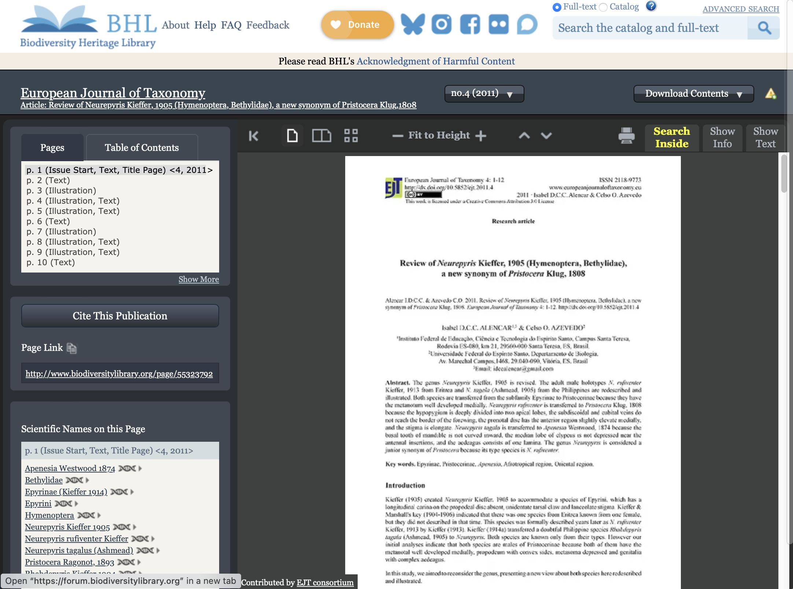
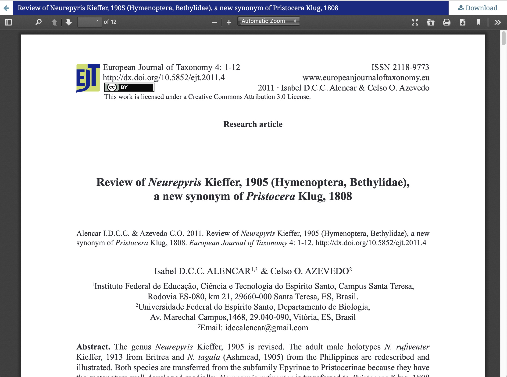
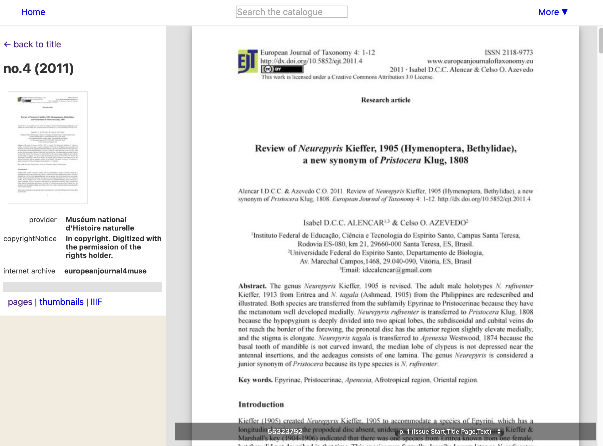
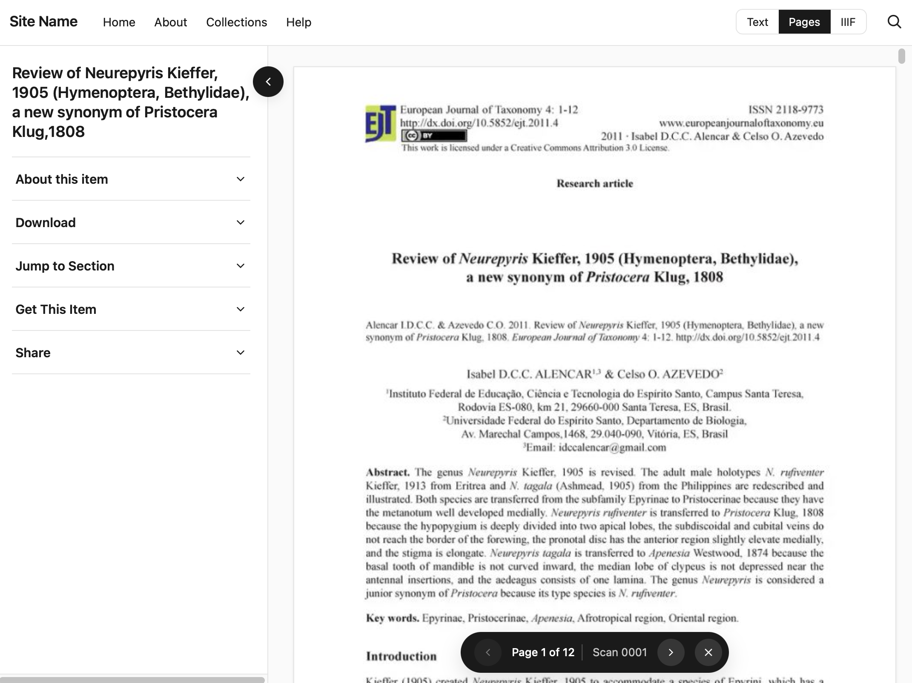
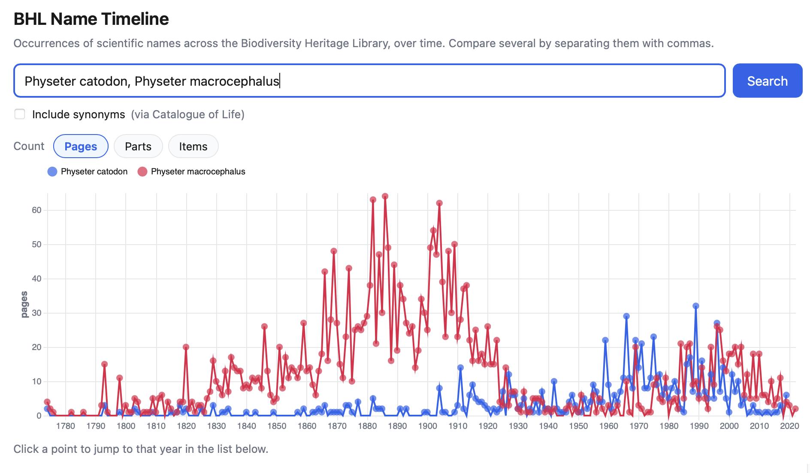
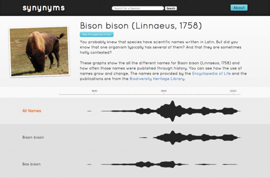
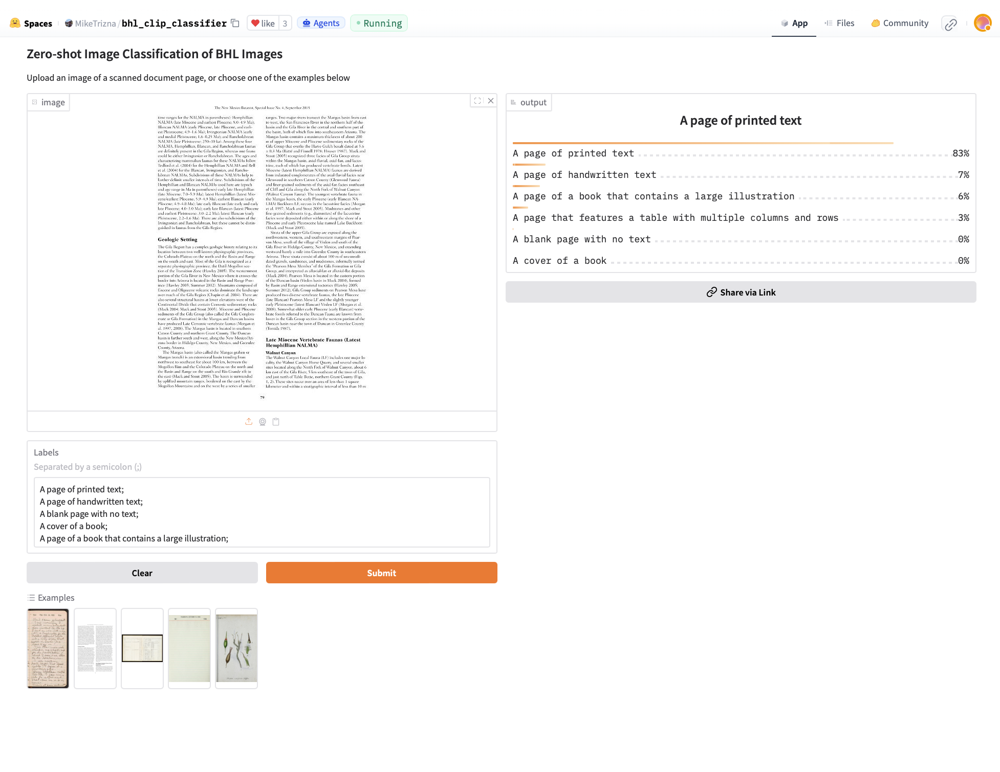
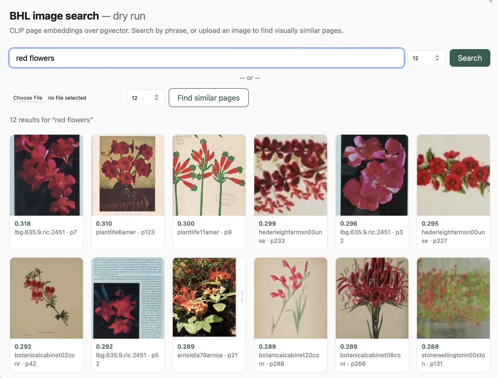

# BHL Workshop

## Overview

This is a workshop on the [Biodiversity Heritage Library](https://www.biodiversitylibrary.org) (BHL), a large, open access collection  of literature on biodiversity.

The goal is to explore some approaches to discovering content in the more than 64 million pages BHL provides. Most of these approaches are exploratory, "proof of concept" tools, and we make no claim that these tools are fit for purpose, or indeed are the only ways we could explore BHL. Indeed, if you have ideas for ways to get more out of BHL pleasse share them.

While the workshop is an in-person event, the activities are all online, so if you are not able to attended you should still be able to get something from this event.

The workshop starts with an opportunity to quickly introduce yourself, followed by a similarly short introduction to BHL. Then we explore a range of topics.

## Introduction

To help get a sense of your interests, and your experience (if any) with BHL, we have a short Menti quiz where you can tell us a little about yourself (anonymously). There are three questions:
- what is your background? (taxonomist, developer, data scientist, )
- how often do you use BHL? (daily, weekly, monthly, infrequently, never)
- what do you like most about BHL?

## BHL overview

The website [BHL on a Hilbert curve](https://iphylo.org/bhl-all-the-pages/) is an attempt to show a small fraction of BHL on a single web page, just to give a sense of the diversity of content in BHL, and one of the primary challenges, which is finding stuff.

If you are taking part in this workshop it is likely that you have some experience with BHL, never the less it is probably worth listing some of the ways to access BHL.

### Ways to access BHL

- BHL displays scanned content using a scrollable viewer ** make a link **
- you can search BHL by taxonomic name or any text term ** make a link **
- there are [data downloads and a well documented API](https://about.biodiversitylibrary.org/tools-and-services/developer-and-data-tools/)
- you can access images and OCR text directly via [Amazon Web Services](https://registry.opendata.aws/bhl-open-data/)
- many of the colour plates (the "pretty") from BHL are also on [Flickr](https://www.flickr.com/photos/biodivlibrary/with/53903344408)
- there is a [public discussion forum](https://forum.biodiversitylibrary.org)

### BHL helpers

There are projects that assist BHL in adding value to its content, such as Global Names (taxonomic name indexing) and BioStor (article finding).

[BioStor](https://biostor.org) has a simple search interface, as well as ways to view articles arranged by journal, and also on a map. we will explore the map feature in more detail below.

## Viewing content

The first topic is probably the most obvious, which is how to display articles on BHL? The current site uses a "book viewer" based on code from the Internet Archive. Let's look at some of the alternatives.

The same article in four different viewers:

- [Current BHL viewer](https://www.biodiversitylibrary.org/item/244617)
- [EJT PDF viewer](https://europeanjournaloftaxonomy.eu/index.php/ejt/article/view/76/25)
- [BHL Light viewer](https://iphylo.org/bhl-light/item/244617)
- [Experimental responsive viewer](https://rdmpage.github.io/responsive-viewer/) (code on [GitHub](https://github.com/rdmpage/responsive-viewer))

The final viewer displays both the BHL page images, but also OCR text from [Datalab](https://www.datalab.to), and an IIIF viewer. The later is a standard widely used in the museum and archive world to display images. We will meet IIIF again below.

We have a short quiz:

- how important is mobile to you?
- how important is a custom BHL viewer (versus, say, just providing PDFs?)
- do you have any suggestions for ways to view BHL content?

## BHL search

to do

## BHL name search

### Taxonomic timelines

Viewing changes in word usage overtime was popularised by the [Google Books Ngram Viewer](https://books.google.com/ngrams/) tool. Ryan Schenk's synynyms tool (now offline, see [Taxonomic name timelines for BHL](https://iphylo.blogspot.com/2016/12/taxonomic-name-timelines-for-bhl.html), Ryna's code is in [GitHub](https://github.com/rschenk/synynyms)) was an early example of a similar approach to taxonomic names. 

In this workshop we will use a simple tool that traces the occurrences of a taxonomic name in BHL over time. In contrast to BHL itself, the [BHL Name Timeline](http://localhost/bhl-name-timeline/) attempts to aggregate occurrences of names by BHL item or part (in other words, if a name occurs in several pages that are part of the same article, BHL Name Timeline lists those occurrences just once).

You can ask the tool to fetch synonymns for a taxonomic name from the [Catalogue of Life ](https://www.catalogueoflife.org), or you can list two or more names separated by comma. For example, you can compare usages of two alternative names for the [sperm whale](https://en.wikipedia.org/wiki/Sperm_whale), _Physeter catodon_ and _Physeter macrocephalus_

## BHL image search

BHL has 64 million images of pages. So far we have concentrated on exploring BHL using text, but what about images? In this section we will look at two tools for image classification and search.

### Image classification

Mike Trizna created a [Hugging Face space](https://huggingface.co/spaces/MikeTrizna/bhl_clip_classifier) that uses OpenAI's [CLIP](https://huggingface.co/openai/clip-vit-base-patch32) model to classify BHL pages. You supply an image (there are examples you can chose from) and a list of possible categories, for example:
- A page of printed text; 
- A page of handwritten text;
- A blank page with no text;
- A cover of a book;
- A page of a book that contains a large illustration;
- A page that features a table with multiple columns and rows

and the tool will return the probability that the image belongs in each of those categories.

Tools like this image classifier could help BHL automate the tags it assigns to pages, perhaps enabling users to search for categories of pages (e.g., "show me pages that display maps").

### Image search

The image classifier Mike Trizna put together inspired the next tool we will look at, [BHL image search](https://iphylo.org/bhl-image-search/), code on [GitHub](https://github.com/rdmpage/bhl-all-the-images). This tool takes a small subset of BHL page images and uses the CLIP model to convert each model to an [embedding](https://en.wikipedia.org/wiki/Embedding_(machine_learning)), that is a vector or list of numbers that represent that image. Images that are similar in some sense will typically have similar vectors, which makes images searchable. 

#### Find similar images

For example, consider this image from Wikipedia [_Acraea violae_](https://en.wikipedia.org/wiki/Acraea_%28butterfly%29#/media/File:Tawny_Coster(হরিনছড়া)DSC_0165.JPG).

DSC_0165.JPG)

We can upload this to https://iphylo.org/bhl-image-search/ and click **Find similar pages** and the site returns images from BHL that resemble that butterfly. You can try this with any image.

#### Find images of...

The CLIP model enables you to search for images based on text, foe example, here are the results for search for [red flowers](https://iphylo.org/bhl-image-search/?q=red+flowers&k=12):

Try this for yourself. For instance, search for "maps"

#### Beyond page images

An obvious limitation of this approach is that we are comparing page images rather than individual images. A more sophisticated approach would be to separate images from text and search on just the images. There are increasingly sophisticated tool for doing this, such as those provided by Datalab (see their [playground](https://www.datalab.to/app/playground/documents/new)). Imagine being able to extract all the figures in BHL and make them searchable (see the next topic for further discussion of how feasible this is).

We have a short quiz:

- is image search useful?
- what could you do with it?

## BHL knowledge discovery layer (NHM)

Qianqian Hiris Gu and Ben Hartley from The Natural History Museum in London are working on extracting knowledge from BHL text. In this part of the workshop they will give an overview of their work, exploring what  of the latest document understanding tools can tell us about BHL content.

## BHL and geography

In this part of the workshop we explore geographic interfaces to literature data. There are various interfaces to biodiversity literature, such as [JournalMap](https://www.journalmap.org) and [BioStor](https://biostor.org/map). While many will be familiar with point-based geographic data, other approaches are available such as grids (e.g., [H3](https://h3geo.org)). The defunct [Frankenplace](http://www.frankenplace.com/) project took a novel approach which mapped text terms to a geographic grid so your search would highlight regions of the world that matched that term (see [Frankenplace, geospatial search, and discrete global grid systems](https://iphylo.blogspot.com/2019/05/frankenplace-geospatial-search-and.html)).

### BioStor map

BioStor comprises the largest source of articles in BHL, and also serves as an experimental platform for displaying BHL content. For example, for each article BioStor finds in BHL it looks for latitude and longitude pairs in the text and puts those on a [map](https://biostor.org/map). You can browse the map, select regions, and see what papers mention those localities. You can also upload GeoJSON (e.g., for an island) and discover what papers include that region in their content.

### Putting maps on the map (Allmaps)

[Allmaps](https://allmaps.org) is a fascinating project where people can add an image of a map to a modern map. The software will handle things such as align the map to latitude and longitude points, rotate and stretch the map image as required. In  order to work Allmaps needs the map image to be available in the [IIIF](https://iiif.io) format.

We have a short quiz:

- what map-based interface works best for you?
- are there any map interfaces you've seen that we've missed?

## Summary

At the end of the workshop we have another Menti quiz.
- what feature we investigated would you most like to see in a future BHL?
- what thing(s) did we miss?

## References

Adams, Benjamin, et al. ‘Frankenplace: Interactive Thematic Mapping for Ad Hoc Exploratory Search’. Proceedings of the 24th International Conference on World Wide Web [Florence Italy], 2015, pp. 12–22. DOI.org (Crossref), https://doi.org/10.1145/2736277.2741137.

Michel, Jean-Baptiste, et al. ‘Quantitative Analysis of Culture Using Millions of Digitized Books’. Science, vol. 331, no. 6014, Jan. 2011, pp. 176–82. DOI.org (Crossref), https://doi.org/10.1126/science.1199644.

Pechenick, Eitan Adam, et al. ‘Characterizing the Google Books Corpus: Strong Limits to Inferences of Socio-Cultural and Linguistic Evolution’. PLOS ONE, edited by Alain Barrat, vol. 10, no. 10, Oct. 2015, p. e0137041. DOI.org (Crossref), https://doi.org/10.1371/journal.pone.0137041.

